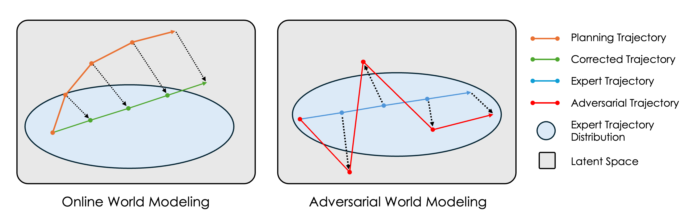

# Adversarial World Models
<div align="center">


| [Paper]() | [Models](#) | [Data](https://osf.io/bmw48/?view_only=a56a296ce3b24cceaf408383a175ce28) | 
</div>


> **Closing the Train-Test Gap in World Models for Gradient-Based Planning**  
> Arjun Parthasarathy\*, Nimit Kalra\*, Rohun Agrawal\*  
> Yann LeCun, Oumayma Bounou, Pavel Izmailov, Micah Goldblum


---

Forked from [DINO-WM](https://github.com/gaoyuezhou/dino_wm).


## Citation
```
@misc{parthasarathy2025closing,
      title={Closing the Train-Test Gap in World Models for Gradient-Based Planning},
      author={Arjun Parthasarathy, Nimit Kalra, Rohun Agrawal, Yann LeCun, Oumayma Bounou, Pavel Izmailov, Micah Goldblum},
      year={2025}
}
```
